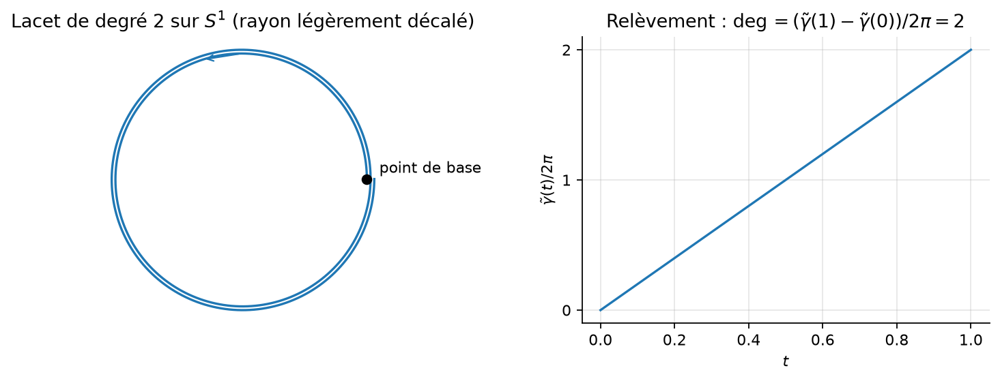
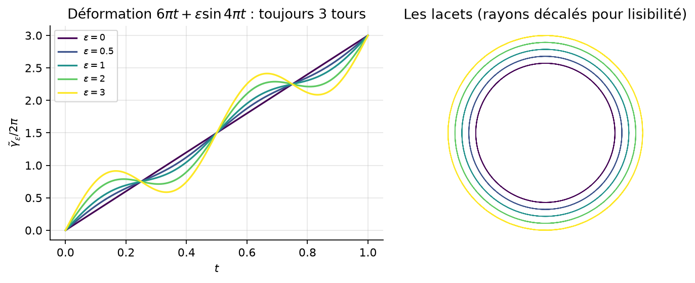
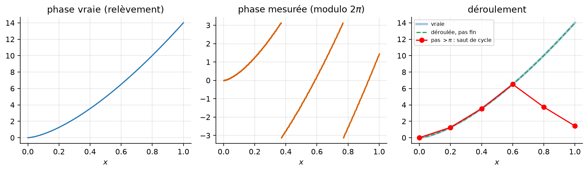
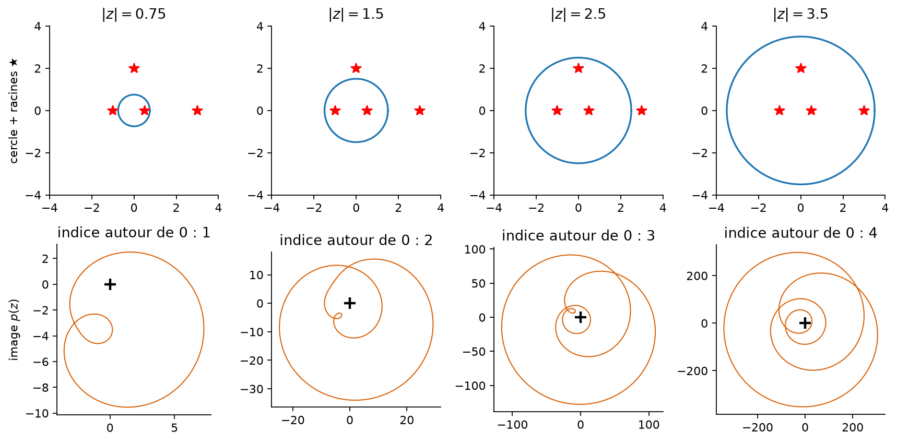
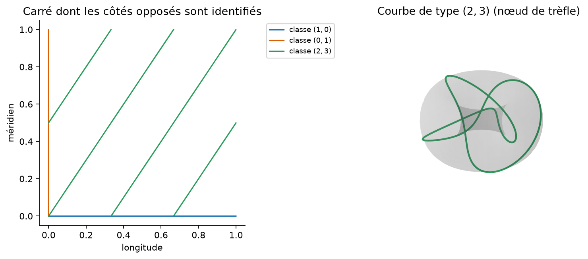
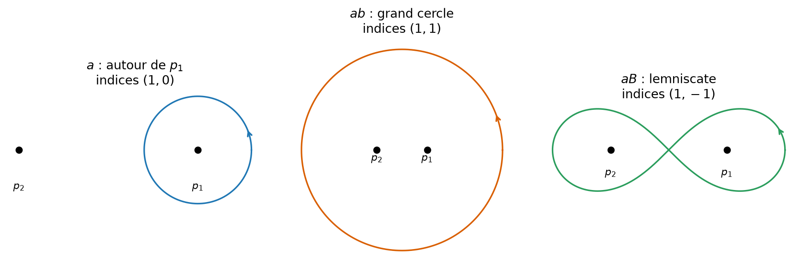
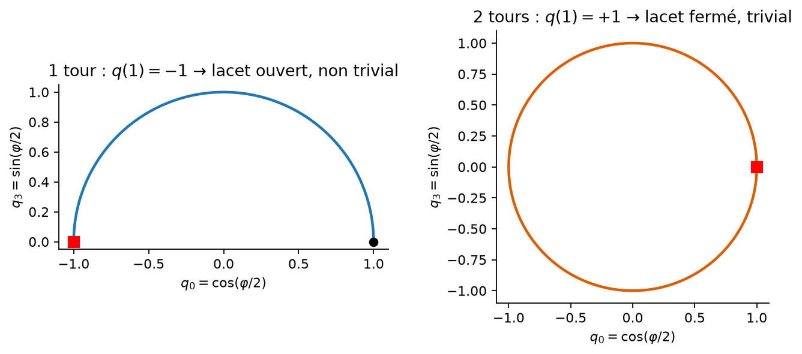
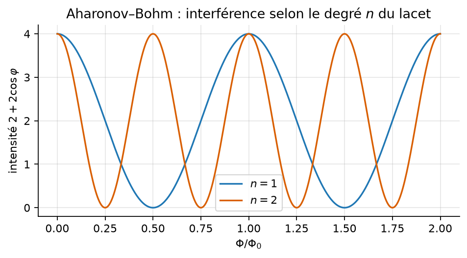
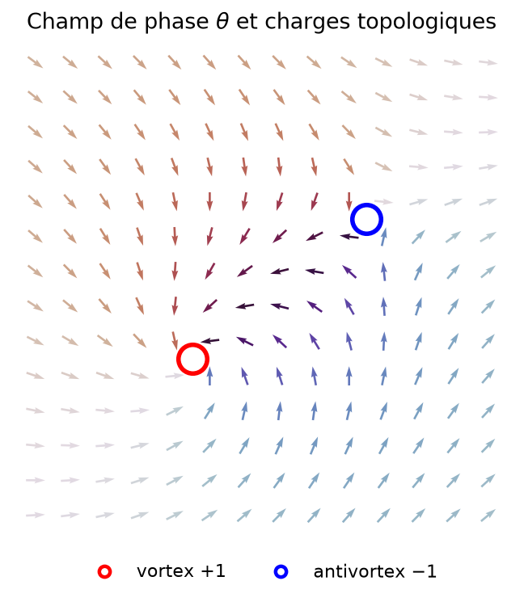
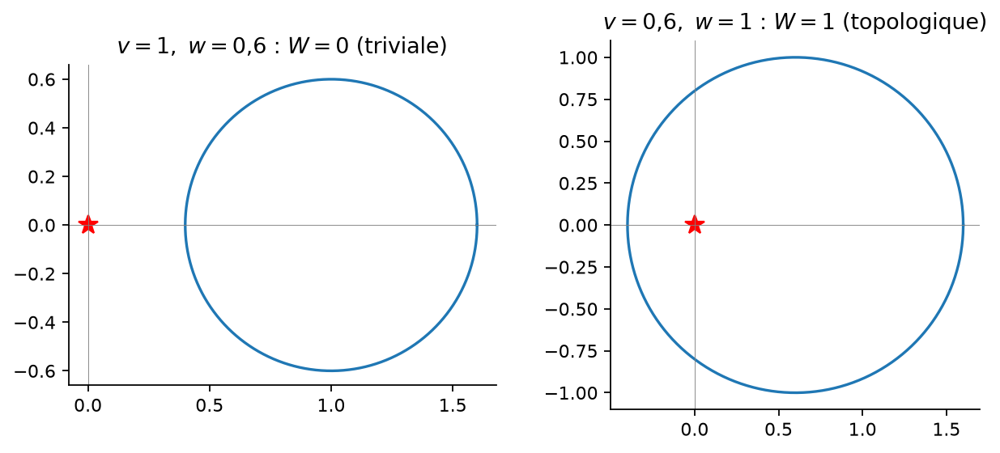

# Le groupe fondamental — cours, exemples et applications

> Ce cours accompagne le programme `fundamental_group.cpp`. Chaque chapitre contient de la théorie, des exemples calculés, une comparaison avec d'autres espaces, des applications physiques ou techniques, et renvoie au module du programme qui l'illustre (`g++ -std=c++17 -O2 fundamental_group.cpp -o fundamental_group && ./fundamental_group`).

**Plan**

0. Motivation : pourquoi compter les tours ?
1. Fondations : homotopie, lacets, groupe $\pi_1(X,x_0)$
2. Le calcul clé : $\pi_1(S^1)\cong\mathbb Z$ (relèvement, degré)
3. Conséquences : Brouwer, théorème de d'Alembert–Gauss, principe de l'argument
4. Produits et tore : $\pi_1(T^2)\cong\mathbb Z^2$
5. Van Kampen, groupes libres, surfaces, nœuds
6. Revêtements : $\mathbb{RP}^2$, $SO(3)$, spineurs
7. Tableau comparatif des espaces
8. Applications modernes (physique, ingénierie, données)
9. Exercices corrigés
10. Le programme : ce qu'il calcule, ses limites
11. Bibliographie

---

## 0. Motivation : pourquoi compter les tours ?

Un lacet sur un cercle, un fil enroulé autour d'un pilier, une phase quantique qui tourne le long d'un trajet : dans tous les cas la **déformation continue** ne peut pas changer « combien de fois on tourne ». Le groupe fondamental est l'outil qui formalise cette idée et l'étend aux espaces compliqués (tores, plans percés, groupes de rotations, espaces de paramètres de la matière).

Trois idées à retenir :

1. On regarde les lacets **à déformation près** (homotopie).
2. Mis bout à bout, les lacets forment un **groupe** (pas forcément commutatif !).
3. C'est un **invariant** : deux espaces homéomorphes ont des groupes isomorphes. Donc si les groupes diffèrent, les espaces diffèrent. Le disque n'est pas le cercle, le tore n'est pas la sphère, le nœud de trèfle n'est pas le nœud trivial.

---

## 1. Fondations

### 1.1 Homotopie

Deux applications continues $f,g : X\to Y$ sont **homotopes** s'il existe $H : X\times[0,1]\to Y$ continue avec $H(\cdot,0)=f$, $H(\cdot,1)=g$. Pour des chemins $\gamma_0,\gamma_1:[0,1]\to X$ de mêmes extrémités, on impose que les extrémités restent fixes pendant la déformation : on note $\gamma_0\simeq\gamma_1$ (rel extrémités).

### 1.2 Le groupe $\pi_1(X,x_0)$

Un **lacet** basé en $x_0$ est un chemin $\gamma$ avec $\gamma(0)=\gamma(1)=x_0$. L'ensemble des classes d'homotopie de lacets est muni de

| opération | définition | rôle |
|---|---|---|
| produit $[\gamma][\delta]$ | parcourir $\gamma$ puis $\delta$ (à vitesse double) | loi interne |
| élément neutre | lacet constant $e_{x_0}$ | $e\gamma\simeq\gamma\simeq\gamma e$ |
| inverse $[\gamma]^{-1}$ | $\bar\gamma(t)=\gamma(1-t)$ | $\gamma\bar\gamma\simeq e$ |

L'associativité vient du fait que $(\gamma\delta)\varepsilon$ et $\gamma(\delta\varepsilon)$ ne diffèrent que par un changement de paramétrage, qui est une homotopie.

### 1.3 Trois propriétés fondamentales

* **Point de base.** Si $X$ est connexe par arcs, $\pi_1(X,x_0)\cong\pi_1(X,x_1)$ par $[\gamma]\mapsto[\bar h\gamma h]$ ($h$ chemin de $x_0$ à $x_1$). On note donc $\pi_1(X)$. L'isomorphisme dépend de $h$ ; les lacets *libres* (non basés) correspondent aux **classes de conjugaison** de $\pi_1$.
* **Fonctorialité.** Une application continue $f:(X,x_0)\to(Y,y_0)$ induit un morphisme $f_*:\pi_1(X,x_0)\to\pi_1(Y,y_0)$, avec $(g\circ f)_*=g_*\circ f_*$ et $\mathrm{id}_*=\mathrm{id}$.
* **Invariance homotopique.** Si $X\simeq Y$ (équivalence d'homotopie), alors $\pi_1(X)\cong\pi_1(Y)$. Exemple : $\mathbb R^n$, un disque, un point ont tous $\pi_1=0$ (espaces **contractiles**) ; un espace avec $\pi_1=0$ est dit **simplement connexe**.

### 1.4 Un argument typique : pas de rétraction

Une **rétraction** $r:X\to A$ vérifie $r\circ i=\mathrm{id}_A$ ($i$ = inclusion). Alors $r_*\circ i_*=\mathrm{id}$, donc $i_*$ est **injective**. Si $A=S^1$ et $X=D^2$ : $i_*:\mathbb Z\to 0$ ne peut pas être injective, donc **il n'existe pas de rétraction du disque sur son bord**. Nous l'utilisons en §3.

---

## 2. Le calcul clé : $\pi_1(S^1)\cong\mathbb Z$

### 2.1 Énoncé

L'application
$$\deg : \pi_1(S^1,1)\longrightarrow\mathbb Z,\qquad [\gamma]\longmapsto \frac{\tilde\gamma(1)-\tilde\gamma(0)}{2\pi}$$
est un isomorphisme de groupes, où $\tilde\gamma:[0,1]\to\mathbb R$ est un **relèvement** de $\gamma$ : $\gamma(t)=e^{i\tilde\gamma(t)}$.

### 2.2 Idée de la preuve (revêtement $p:\mathbb R\to S^1$, $p(\theta)=e^{i\theta}$)

1. **Relèvement des chemins** : tout chemin de $S^1$ issu de $1$ se relève de façon unique en un chemin de $\mathbb R$ issu de $0$. (Localement $p$ est un homéomorphisme ; on recolle.)
2. **Relèvement des homotopies** : si $\gamma_0\simeq\gamma_1$ (extrémités fixes), leurs relèvements ont la même extrémité $\tilde\gamma_0(1)=\tilde\gamma_1(1)$. Donc $\deg$ est **bien défini sur les classes**.
3. **Morphisme** : le relèvement de $\gamma\delta$ est $\tilde\gamma$ suivi de $\tilde\delta+\tilde\gamma(1)$ ; les degrés s'ajoutent.
4. **Surjectif** : $\gamma_n(t)=e^{2\pi i nt}$ a pour degré $n$.
5. **Injectif** : si $\deg\gamma=0$, le relèvement est une boucle de $\mathbb R$, et $H_s=(1-s)\tilde\gamma$ la contracte ; on redescend par $p$.

> **Illustration numérique** (`chapter1`). On vérifie $\deg(a\!\cdot\! b)=\deg a+\deg b$, $\deg(a^{-1})=-\deg a$, et on déforme une boucle de degré 3 par $\theta_\varepsilon(t)=6\pi t+\varepsilon\sin(4\pi t)$ pour $\varepsilon\in\{0,0.5,1,2,3\}$ : le degré reste $3$. Les autres boucles se contractent par l'homotopie linéaire de l'étape 5.


*Figure 1 — Un lacet de degré 2 et son relèvement dans $\mathbb R$ : le degré se lit sur la hauteur finale.*


*Figure 2 — Déformer le lacet (à base fixée) ne change pas le degré.*

### 2.3 Pourquoi le relèvement est indispensable

L'ancienne version du programme composait des boucles en reconvertissant chaque point par `atan2`, ce qui ramène $2\pi$ à $0$ : **l'information « nombre de tours » était perdue**. C'est exactement l'erreur que le relèvement corrige. De même, la seconde « boucle » de l'ancien exemple, $0\to\pi$, n'est pas fermée : c'est un *chemin*, pas un élément de $\pi_1$ (la loi de groupe n'est définie que pour des lacets de même base).

### 2.4 Règle d'échantillonnage (et cycle slip)

Un lacet est connu par des points. On reconstruit le relèvement en prenant, entre deux points consécutifs, le **plus court arc** (écart dans $]-\pi,\pi]$). C'est correct **si et seulement si le pas est $<\pi$** : c'est la condition de Nyquist de la phase. Contre-exemple du programme : les angles $0,\,4,\,8,\,2\pi$ (pas $4>\pi$) donnent « degré $-1$ » au lieu de $+1$.

En pratique (GPS, interférométrie radar InSAR, IRM) ce phénomène s'appelle **saut de cycle** (*cycle slip*) ou *phase unwrapping error*, cf. §8.6.


*Figure 3 — Phase mesurée modulo $2\pi$, déroulement correct (pas $<\pi$) et saut de cycle (pas $>\pi$).*

---

## 3. Conséquences célèbres

### 3.1 Théorème du point fixe de Brouwer (dimension 2)

*Toute application continue $f:D^2\to D^2$ a un point fixe.* Sinon $r(x)$ = point où la demi-droite de $f(x)$ vers $x$ coupe le bord serait une rétraction $D^2\to S^1$, contredisant §1.4.

Applications : existence d'équilibres (Nash en théorie des jeux se démontre par une version en dimension $n$), tasse de café remuée : un point revient en place.

### 3.2 Théorème de d'Alembert–Gauss

Soit $p(z)=z^n+a_{n-1}z^{n-1}+\dots+a_0$, $n\ge1$. Pour $R$ grand, la courbe $t\mapsto p(Re^{it})$ est homotope (dans $\mathbb C^*$) à $t\mapsto R^ne^{int}$, donc son degré autour de $0$ vaut $n\neq0$. Si $p$ n'avait pas de racine dans $|z|\le R$, la courbe se contracterait dans $\mathbb C^*$ via $p(re^{it})$, $r\in[R,0]$, donc serait de degré $0$ : contradiction.

### 3.3 Principe de l'argument

Plus précisément : le degré de $t\mapsto p(Re^{it})$ autour de $0$ est **le nombre de zéros de $p$ dans le disque** (comptés avec multiplicité). Localement, une racine simple contribue $+1$.

> **Illustration** (`chapter2`). Avec $p(z)=(z-0.5)(z+1)(z-2i)(z-3)$, dont les modules des racines sont $0.5,\ 1,\ 2,\ 3$ :
>
> | rayon $R$ | 0.75 | 1.5 | 2.5 | 3.5 |
> |---|---|---|---|---|
> | indice de $p(\text{cercle})$ autour de 0 | 1 | 2 | 3 | 4 |
>
> Le programme calcule ces indices en sommant $\arg\big(p(z_{k+1})/p(z_k)\big)$ — sans jamais chercher les racines.


*Figure 4 — Le cercle $|z|=R$ (racines en rouge) et son image par $p$ : l'indice autour de $0$ compte les racines enfermées.*

**Usage réel** : c'est le principe derrière le critère de Nyquist (§8.5).

---

## 4. Produits et tore

### 4.1 Théorème du produit

$\pi_1(X\times Y)\cong\pi_1(X)\times\pi_1(Y)$ (un lacet dans le produit est un couple de lacets).

### 4.2 Le tore $T^2=S^1\times S^1$

$\pi_1(T^2)\cong\mathbb Z\times\mathbb Z$, **abélien**. Un lacet a deux degrés : $m$ tours en longitude, $n$ en méridien. La courbe $t\mapsto(e^{2\pi i pt},e^{2\pi i qt})$ a pour classe $(p,q)$ ; c'est un nœud sur le tore (nœud torique) si $\gcd(p,q)=1$.

> **Illustration** (`chapter3`). Longitude $m=(1,0)$, méridien $l=(0,1)$ : $ml\mapsto(1,1)$ et $lm\mapsto(1,1)$ (commutatif) ; la courbe $(2,3)$ est le nœud de trèfle tracé sur le tore.


*Figure 5 — Sur le tore, une courbe a deux degrés ; la courbe $(2,3)$ est un nœud de trèfle.*

**Comparaison.** $S^2$ est simplement connexe alors que $T^2$ ne l'est pas : c'est une preuve élémentaire que $S^2\not\cong T^2$ (on peut aussi les distinguer par leur caractéristique d'Euler, $2$ contre $0$ ; l'avantage de $\pi_1$ est qu'il détecte en plus la *structure* des lacets, par exemple $\mathbb Z$ contre $F_2$).

---

## 5. Van Kampen, groupes libres, surfaces, nœuds

### 5.1 Théorème de Seifert–van Kampen

Si $X=U\cup V$ avec $U,V,U\cap V$ ouverts connexes par arcs, alors
$$\pi_1(X)\cong\pi_1(U)*_{\pi_1(U\cap V)}\pi_1(V)$$
(produit amalgamé). Si $U\cap V$ est simplement connexe, c'est le **produit libre** $\pi_1(U)*\pi_1(V)$.

* **Sphère $S^n$, $n\ge2$** : $U,V$ = sphère privée d'un pôle (contractiles), $U\cap V\simeq S^{n-1}$ connexe ; donc $\pi_1(S^n)=0$.
* **Bouquet de deux cercles** $S^1\vee S^1$ (un « huit ») : $\pi_1=\mathbb Z*\mathbb Z=F_2=\langle a,b\rangle$, **groupe libre**, non abélien.

### 5.2 Plan privé de $n$ points

$\mathbb R^2\setminus\{p_1,\dots,p_n\}\simeq\bigvee_n S^1$, donc $\pi_1=F_n$. Les générateurs $a_k$ = « un tour autour de $p_k$ ».

**Mots réduits.** Dans $F_2=\langle a,b\rangle$, tout élément s'écrit de façon **unique** comme mot sans $aA$, $Aa$, $bB$, $Bb$ ($A=a^{-1}$, $B=b^{-1}$). Le programme implémente la réduction libre par pile :

```
abBAab  →  ab         (bB et Aa s'éliminent)
aAbBaB  →  aB
```

**Le commutateur.** $[a,b]=abAB\neq e$ dans $F_2$, alors que son image dans $\mathbb Z^2$ (nombre total de $a$, de $b$) est $(0,0)$. Géométriquement, cela veut dire qu'une courbe peut avoir des indices nuls autour des deux trous sans être contractile dans le plan percé : **l'indice seul (homologie $H_1$) perd de l'information, le groupe fondamental la garde**.

> **Illustration** (`chapter4`). Avec $p_1=(0.5,0)$, $p_2=(-0.5,0)$ :
>
> | courbe | (indice autour de $p_1$, autour de $p_2$) | mot |
> |---|---|---|
> | petit cercle autour de $p_1$ | $(1,0)$ | $a$ |
> | grand cercle | $(1,1)$ | $ab$ |
> | lemniscate (un lobe +, l'autre −) | $(1,-1)$ | $aB$ |


*Figure 6 — Trois lacets du plan percé de deux points, avec leur mot dans $F_2$ et leurs indices.*

### 5.3 Surfaces

Surface orientable de genre $g$ : $\pi_1=\langle a_1,b_1,\dots,a_g,b_g\mid [a_1,b_1]\cdots[a_g,b_g]\rangle$ ; son abélianisé $H_1=\mathbb Z^{2g}$. Bouteille de Klein : $\langle a,b\mid abab^{-1}\rangle$, $H_1=\mathbb Z\oplus\mathbb Z/2$.

### 5.4 Nœuds

Le groupe du nœud $K\subset\mathbb R^3$ est $\pi_1(\mathbb R^3\setminus K)$.

* Nœud trivial : $\mathbb Z$.
* Trèfle : $\langle x,y\mid xyx=yxy\rangle$ (groupe de tresses $B_3$), **non abélien** (il se surjecte sur $S_3$). Donc **le trèfle n'est pas le nœud trivial**, même si leurs abélianisés sont tous deux $\mathbb Z$ — un nouvel exemple où $\pi_1$ voit plus que l'homologie.

### 5.5 Graphes et circuits

Un graphe connexe à $V$ sommets et $E$ arêtes a $\pi_1=F_r$ avec $r=E-V+1$ (nombre cyclomatique). C'est le nombre de **mailles indépendantes** de la loi des mailles de Kirchhoff.

---

## 6. Revêtements, $\mathbb{RP}^2$, $SO(3)$, spineurs

Un revêtement $p:\tilde X\to X$ avec $\tilde X$ simplement connexe (**revêtement universel**) a pour groupe de transformations $\pi_1(X)$. Exemples :

| espace $X$ | revêtement universel | $\pi_1(X)$ |
|---|---|---|
| $S^1$ | $\mathbb R$ | $\mathbb Z$ |
| $T^2$ | $\mathbb R^2$ | $\mathbb Z^2$ |
| $\mathbb{RP}^2=S^2/\pm$ | $S^2$ | $\mathbb Z/2$ |
| $SO(3)=S^3/\pm$ | $S^3=SU(2)$ | $\mathbb Z/2$ |

### 6.1 $\pi_1(SO(3))=\mathbb Z/2$

Une rotation d'angle $\varphi$ autour d'un axe $\mathbf n$ se relève en le quaternion unitaire $q=\big(\cos\tfrac\varphi2,\ \sin\tfrac\varphi2\,\mathbf n\big)\in S^3$, et $q$ et $-q$ donnent la même rotation. Faire un tour complet ($\varphi:0\to2\pi$) mène de $q=1$ à $q=-1$ : le relèvement n'est **pas fermé**, donc le lacet de rotations est non trivial dans $SO(3)$. Deux tours ramènent à $q=+1$ : lacet trivial.

> **Illustration** (`chapter7`) : $k=0,\dots,4$ tours donnent $q(1)=+1,-1,+1,-1,+1$ : la classe dans $\mathbb Z/2$ est $k\bmod 2$.


*Figure 7 — Le relèvement dans $SU(2)$ d'un tour de $SO(3)$ finit en $-1$ : lacet non trivial ; deux tours le referment.*

**Réalité physique.**

* **Spin ½.** La fonction d'onde d'un fermion change de signe après une rotation de $2\pi$ et ne revient qu'après $4\pi$ : les spineurs sont des représentations de $SU(2)$, pas de $SO(3)$. La sonde expérimentale est l'interférométrie de neutrons (Rauch, Werner 1975), qui a mesuré ce signe.
* **Trick de la ceinture (Dirac)** : une ceinture dont une extrémité est tournée de $2\pi$ ne peut pas être démêlée sans tourner l'extrémité ; tournée de $4\pi$, si. C'est $\pi_1(SO(3))=\mathbb Z/2$ vécu avec les mains.
* **Robotique / animation** : les rotations représentées par quaternions évitent le blocage de cardan et on doit choisir entre $q$ et $-q$ (double couverture) pour interpoler par le plus court chemin.

---

## 7. Tableau comparatif

| Espace | $\pi_1$ | abélien ? | $H_1=\pi_1^{\rm ab}$ | Ce qu'il illustre |
|---|---|---|---|---|
| point, $\mathbb R^n$, disque | $0$ | oui | $0$ | espaces contractiles |
| $S^n$, $n\ge2$ | $0$ | oui | $0$ | pas de lacet non trivial |
| $S^1$ | $\mathbb Z$ | oui | $\mathbb Z$ | phase, angle, degré |
| $T^2$ | $\mathbb Z^2$ | oui | $\mathbb Z^2$ | deux phases indépendantes |
| $\mathbb R^2\setminus\{n\text{ pts}\}$ | $F_n$ | **non** ($n\ge2$) | $\mathbb Z^n$ | flux, vortex, obstacles |
| $S^1\vee S^1$ | $F_2$ | **non** | $\mathbb Z^2$ | huit, graphe à 2 cycles |
| $\mathbb{RP}^2$ | $\mathbb Z/2$ | oui | $\mathbb Z/2$ | nématiques, demi-tours |
| $SO(3)$ | $\mathbb Z/2$ | oui | $\mathbb Z/2$ | spineurs |
| $SU(2)=S^3$ | $0$ | oui | $0$ | revêtement universel |
| surface de genre $g$ | $\langle a_i,b_i\mid\prod[a_i,b_i]\rangle$ | **non** ($g\ge2$) | $\mathbb Z^{2g}$ | classification des surfaces |
| bouteille de Klein | $\langle a,b\mid abab^{-1}\rangle$ | **non** | $\mathbb Z\oplus\mathbb Z/2$ | non orientable |
| complément du trèfle | $\langle x,y\mid xyx=yxy\rangle$ | **non** | $\mathbb Z$ | nœuds |
| nématique biaxial $SO(3)/D_2$ | $Q_8$ (quaternions, ordre 8) | **non** | $(\mathbb Z/2)^2$ | défauts non commutatifs |

**Lecture comparative.**

* $\pi_1$ **vs $H_1$** : $H_1$ est l'abélianisé de $\pi_1$ (Hurewicz). Il suffit pour $S^1$, $T^2$, $\mathbb{RP}^2$ mais perd l'information pour $F_2$ (commutateur), le trèfle…
* $\pi_1$ **vs $\pi_0$** : $\pi_0$ compte les composantes connexes ; $\pi_1$ les lacets ; $\pi_2$ les sphères non contractiles, etc. La topologie de la matière utilise toute cette hiérarchie : $\pi_1$ → lignes de défauts, $\pi_2$ → points (monopôles), $\pi_3$ → textures (skyrmions 3D).
* **Groupe abélien vs non abélien** : $\mathbb Z$ et $\mathbb Z^2$ → les défauts s'additionnent simplement ; $F_2$ ou $Q_8$ → l'ordre de combinaison compte, deux défauts peuvent ne plus se croiser sans créer un troisième défaut.

---

## 8. Applications modernes

### 8.1 Effet Aharonov–Bohm (électromagnétisme quantique)

Un solénoïde (flux $\Phi$) traverse le plan. La région accessible aux électrons est $\mathbb R^2\setminus\{\text{point}\}$, avec $\pi_1=\mathbb Z$. Le champ $B$ est nul là où passe l'électron, mais la phase acquise le long d'un trajet $\gamma$ est
$$\varphi(\gamma)=\frac{e}{\hbar}\oint_\gamma A\cdot d\ell=2\pi\,n(\gamma)\,\frac{\Phi}{\Phi_0},\qquad \Phi_0=\frac he\approx 4{,}14\times10^{-15}\ \mathrm{Wb},$$
où $n$ est le **degré** : seule la classe d'homotopie du lacet compte. L'intensité d'interférence de deux trajets vaut $\propto 2+2\cos\varphi$.

> **Illustration** (`chapter6`). $\Phi/\Phi_0=1/2$ et $n=1$ : intensité $0$ (franges éteintes). $\Phi=\Phi_0$ : indiscernable de $\Phi=0$. Et $n=2$, $\Phi=\Phi_0/4$ donne aussi l'extinction : c'est le degré qui décide.


*Figure 8 — Intensité d'interférence en fonction du flux, pour des trajets de degré $n=1$ et $n=2$.*

Dans un supraconducteur, le flux piégé dans un anneau est quantifié en unités $h/2e\approx2{,}07\times10^{-15}$ Wb : c'est la quantification de $\pi_1(S^1)=\mathbb Z$ pour la phase du condensat (SQUID, qubits supraconducteurs).

### 8.2 Vortex dans les superfluides et supraconducteurs

Le paramètre d'ordre $\psi=|\psi|e^{i\theta}$ prend ses valeurs sur $S^1$ hors du cœur. Autour d'un vortex, la phase tourne de $2\pi n$ : la **circulation est quantifiée**
$$\oint v\cdot d\ell=\frac{\hbar}{m}\oint\nabla\theta\cdot d\ell=n\,\frac hm$$
($h/m_{^4\mathrm{He}}\approx10^{-7}\ \mathrm{m^2/s}$). Le cœur ne peut pas être supprimé par une déformation douce : l'indice est topologique. Une paire vortex–antivortex (charge totale $0$) peut s'annihiler, un vortex isolé non — c'est la physique de la **transition de Kosterlitz–Thouless** (Nobel 2016).

> **Illustration** (`chapter5`). Un champ de phase $\theta=\arg(z-v)-\arg(z-v')$ (un vortex en $v$, un antivortex en $v'$) sur un réseau $14\times14$. On calcule, pour chaque plaquette, $\frac1{2\pi}\sum(\text{écarts de phase dans }]-\pi,\pi])$ ; le programme affiche une carte où seules deux plaquettes sont non nulles (`+` et `-`, figure 9). La somme sur tout le bord du réseau vaut $0$ (charge totale nulle) mais le bord d'un petit rectangle autour du vortex seul vaut $+1$ : c'est la version discrète du théorème de Stokes, $\deg(\partial R)=\sum_{P\subset R}\text{charge}(P)$.


*Figure 9 — Champ de phase d'une paire vortex–antivortex et plaquettes de charge non nulle détectées par le programme.*

### 8.3 Défauts topologiques, cristaux liquides, cosmologie

Mermin (1979) : pour un milieu dont l'espace des paramètres d'ordre est $R$, les **lignes de défauts** sont classifiées par $\pi_1(R)$, les points par $\pi_2(R)$.

| milieu | $R$ | $\pi_1(R)$ | conséquence |
|---|---|---|---|
| superfluide, XY, supra | $S^1$ | $\mathbb Z$ | vortex de charge $n$, additifs |
| nématique uniaxial (LCD, écrans) | $\mathbb{RP}^2$ | $\mathbb Z/2$ | lignes de disinclinaison « demi-entières » $\pm\tfrac12$ ; deux lignes identiques s'annihilent ($1/2+1/2=1\simeq0$ en 3D, par « échappement dans la 3ᵉ dimension ») |
| nématique biaxial | $SO(3)/D_2$ | $Q_8$ | défauts **non commutatifs** : deux lignes ne peuvent se croiser sans en créer une troisième |
| cosmologie (brisure $U(1)$) | $S^1$ | $\mathbb Z$ | cordes cosmiques (mécanisme de Kibble) |

### 8.4 Matière topologique : la chaîne SSH

La chaîne de Su–Schrieffer–Heeger (polyacétylène) est décrite par $h(k)=v+w\,e^{ik}$, $k\in S^1$ (zone de Brillouin). Tant que le gap est ouvert ($|v|\ne|w|$), $h(k)\neq0$ et $k\mapsto h(k)$ est un lacet de $\mathbb C^*\simeq S^1$, de **nombre d'enroulement**
$$W=\begin{cases}0&|v|>|w|\quad(\text{phase triviale})\\ 1&|w|>|v|\quad(\text{phase topologique}).\end{cases}$$
Par la correspondance bulk–bord, $W=1$ implique des **états de bord** protégés. $W$ ne change qu'en fermant le gap, comme le degré ne change que si la courbe traverse l'origine.

> **Illustration** (`chapter8`) : $(v,w)=(1,0.4),(1,0.8)\to W=0$ ; $(0.4,1),(0.8,1),(0.5,-1)\to W=1$.

(Les phases de Chern / Hall quantique relèvent de $\pi_2$ et des nombres de Chern ; l'enroulement est leur analogue unidimensionnel.)


*Figure 10 — Courbe $k\mapsto h(k)$ de la chaîne SSH : elle entoure l'origine (phase topologique) ou non.*

### 8.5 Ingénierie : critère de Nyquist

Soit $L(s)$ la fonction de transfert en boucle ouverte, $P$ son nombre de pôles instables. Le système bouclé est stable ssi la courbe de Nyquist de $L$ entoure $-1$ exactement $P$ fois **dans le sens trigonométrique** (formule $Z=N+P$ avec $N$ = nombre de tours horaires et $Z$ = pôles instables du système bouclé ; on veut $Z=0$). C'est le principe de l'argument du §3.3 appliqué au contour de Nyquist : on **compte des degrés** pour savoir si un avion, un amplificateur ou une régulation thermique sont stables, sans calculer de pôles.

### 8.6 Phase unwrapping : GPS, InSAR, IRM

Une phase mesurée modulo $2\pi$ est un point de $S^1$, la grandeur physique est son relèvement dans $\mathbb R$. On déroule en intégrant les écarts ramenés dans $]-\pi,\pi]$ ; c'est exactement `Loop::from_angles`. Sur une carte 2D, les « résidus » (plaquettes de charge $\pm1$, cf. §8.2) sont des vortex de la phase mesurée ; les algorithmes de déroulement (Goldstein, *branch cuts*, *minimum cost flow*) doivent relier ces résidus. Une phase qui évolue de plus de $\pi$ entre deux pixels provoque un saut de cycle (cf. §2.4) : erreur de $2\pi$ sur l'altitude ou le déplacement du sol.

### 8.7 Robotique et planification de mouvement

L'espace des configurations d'un bras plan à deux articulations est $T^2$ ; celui d'un bras à $n$ articulations est $T^n$ avec $\pi_1=\mathbb Z^n$. Les obstacles retirent des régions de cet espace ; les classes d'homotopie de trajets libres décrivent les « façons distinctes de contourner les obstacles » — deux trajets non homotopes ne peuvent pas être déformés l'un en l'autre sans collision, et un planificateur doit les explorer séparément. Pour un robot mobile dans un plan avec $n$ piliers, le groupe des trajets est $F_n$ : le nombre de classes de trajets croît **exponentiellement** avec le nombre de tours autorisés.

### 8.8 Données : homologie persistante

L'analyse topologique de données calcule, sur un nuage de points filtré, des classes de lacets (l'homologie $H_1$ persistante) : un cycle qui « vit longtemps » révèle un vrai trou (orbite périodique dans une série temporelle, anneau de pores dans une molécule, boucle dans les connexions cérébrales). On utilise $H_1=\pi_1^{\rm ab}$ parce qu'il est calculable par algèbre linéaire, au prix de perdre la non-commutativité (cf. §7).

### 8.9 Circuits

Par §5.5, le nombre de mailles indépendantes d'un réseau électrique de $E$ branches et $V$ nœuds connexe est $E-V+1$ : c'est le rang de $\pi_1$ du graphe, donc le nombre d'équations de tensions de Kirchhoff nécessaires.

---

## 9. Exercices corrigés

**Ex. 1.** Calculer le degré de $\gamma(t)=e^{2\pi i(3t+\sin(2\pi t))}$ et de $\delta(t)=e^{-4\pi it}$. Quel est celui de $\gamma\delta$ ?
*Corrigé.* Les relèvements sont $2\pi(3t+\sin 2\pi t)$ et $-4\pi t$. Degrés : $3$ et $-2$. Degré de $\gamma\delta$ : $3+(-2)=1$.

**Ex. 2.** Montrer que le cercle $S^1$ n'est pas un rétracte du disque, puis que $\mathbb R^2$ et $\mathbb R^3$ ne sont pas homéomorphes.
*Corrigé.* 1ʳᵉ partie : §1.4. 2ᵉ partie : si $h:\mathbb R^2\to\mathbb R^3$ était un homéomorphisme, $\mathbb R^2\setminus\{0\}\cong\mathbb R^3\setminus\{h(0)\}$ ; or $\pi_1(\mathbb R^2\setminus0)=\mathbb Z$ et $\pi_1(\mathbb R^3\setminus\text{pt})=\pi_1(S^2)=0$.

**Ex. 3.** Combien de racines $p(z)=z^5+3z+1$ a-t-elle dans $|z|<1$ ? Dans $|z|<2$ ? Vérifier avec le programme (adapter `chapter2`).
*Corrigé.* Sur $|z|=1$ : $|3z|=3>2\ge|z^5+1|$, donc $p$ a autant de racines que $3z$ dans le disque : **1** (l'indice de $p(e^{it})$ autour de $0$ est celui de $3e^{it}$, soit $1$). Sur $|z|=2$ : $|z^5|=32>7\ge|3z+1|$, donc $p$ a autant de racines que $z^5$ : **5**. C'est le théorème de Rouché, qui n'est autre que l'homotopie $p_s=f+s\,g$ dans $\mathbb C^*$ : le degré ne change pas tant que la courbe évite $0$.

**Ex. 4.** Dans $F_2$, réduire $abAbaBBA$ et calculer son image dans $\mathbb Z^2$.
*Corrigé.* $abAbaBBA$ : pas de paire $xX$ adjacente ($a\,b\,A\,b\,a\,B\,B\,A$) → mot déjà réduit. Image : $a$ apparaît $2$ fois en positif, $A$ $2$ fois ; $b$ : $2$, $B$ : $2$ → $(0,0)$, mais le mot est $\ne e$.

**Ex. 5.** Vérifier qu'un champ de phase $\theta(x,y)=\arg(z-z_0)$ sur un réseau a charge $1$ dans la plaquette qui contient $z_0$ et $0$ ailleurs.
*Corrigé.* Hors du voisinage de $z_0$ le champ est régulier (curl discret nul, somme des écarts $=0$) ; autour de $z_0$ on gagne $2\pi$. C'est ce que montre la carte de `chapter5`.

**Ex. 6 (physique).** Deux vortex de charge $+1$ fusionnent. Quelle est la charge ? Et pour deux défauts $+\tfrac12$ d'un nématique ? Et dans $Q_8$ ?
*Corrigé.* Superfluide : $1+1=2$ (les charges s'ajoutent dans $\mathbb Z$). Nématique : $\tfrac12+\tfrac12=1\equiv0$ dans $\mathbb Z/2$ : trivial. Dans $Q_8$ le produit dépend de l'ordre : $ij=k$, $ji=-k$ — les deux fusions ne donnent pas le même défaut.

**Ex. 7 (SO(3)).** On compose une rotation de $2\pi$ autour de $x$ et une de $2\pi$ autour de $y$. Est-ce un lacet trivial de $SO(3)$ ?
*Corrigé.* Les deux lacets sont dans la classe non triviale de $\mathbb Z/2$ (une rotation d'un tour autour de n'importe quel axe relève en $q\to-q$) ; le produit vaut $1+1=0$ : **trivial**, même si les axes diffèrent. On peut vérifier avec les quaternions : relevé $1\to-1\to+1$.

---

## 10. Le programme `fundamental_group.cpp`

### 10.1 Ce qui a changé par rapport à la première version

| Première version | Cette version |
|---|---|
| un `vector<Point>` sur le cercle | **relèvement** $\tilde\gamma$ : on garde le nombre de tours |
| `compose` par `atan2` (perd $2\pi\to0$) | `compose` additionne les relèvements |
| aucune notion de degré | `degree()` = isomorphisme $\pi_1(S^1)\to\mathbb Z$ |
| boucle « 0 → π » acceptée | `closed()` refuse les chemins non fermés |
| pas d'inverse | `inverse()` = chemin à l'envers |
| un seul espace | $S^1$, $T^2$, plan percé, réseau de phase, $SO(3)$, SSH |

### 10.2 Correspondance cours ↔ code

| chapitre du cours | fonction | ce qu'on y vérifie |
|---|---|---|
| §2 | `chapter1` | axiomes de groupe, invariance homotopique, contraction, erreurs d'échantillonnage |
| §3.3, §8.5 | `chapter2` | indice = nombre de racines |
| §4 | `chapter3` | $\mathbb Z^2$, commutativité, courbe $(2,3)$ |
| §5.2 | `chapter4` | réduction libre, commutateur, indices par trou |
| §8.2, §8.6 | `chapter5` | charge topologique et Stokes discret |
| §8.1 | `chapter6` | phase d'Aharonov–Bohm |
| §6.1 | `chapter7` | $\pi_1(SO(3))=\mathbb Z/2$ par quaternions |
| §8.4 | `chapter8` | enroulement SSH |

Le programme termine par `0` si toutes les vérifications `[OK]` passent, ce qui permet de l'utiliser en test automatique.

### 10.3 Limites

* C'est une **illustration numérique**, pas une preuve : on échantillonne des courbes. Le degré n'est correct que si le pas est $<\pi$ (§2.4).
* Le calcul de $\pi_1$ d'un espace quelconque est **indécidable** en général (Markov, 1958 : le problème du mot est indécidable, et tout groupe de présentation finie est le $\pi_1$ d'une variété de dimension 4). Le programme traite donc des espaces dont $\pi_1$ est connu.
* Les groupes libres sont manipulés symboliquement ; le lien avec la géométrie (chapitre 4) passe par les indices, c'est-à-dire l'abélianisation.

---

## 11. Bibliographie

* A. Hatcher, *Algebraic Topology*, Cambridge UP, 2002 (chap. 1, en ligne gratuitement).
* J. Munkres, *Topology*, 2ᵉ éd., Pearson, 2000 (§§51–60).
* W. Massey, *A Basic Course in Algebraic Topology*, Springer, 1991.
* N. D. Mermin, « The topological theory of defects in ordered media », *Rev. Mod. Phys.* **51**, 591 (1979).
* Y. Aharonov, D. Bohm, « Significance of electromagnetic potentials in the quantum theory », *Phys. Rev.* **115**, 485 (1959).
* J. M. Kosterlitz, D. J. Thouless, « Ordering, metastability and phase transitions in two-dimensional systems », *J. Phys. C* **6**, 1181 (1973).
* W. P. Su, J. R. Schrieffer, A. J. Heeger, « Solitons in polyacetylene », *Phys. Rev. Lett.* **42**, 1698 (1979).
* J. K. Asbóth, L. Oroszlány, A. Pályi, *A Short Course on Topological Insulators*, Springer, 2016.
* S. M. LaValle, *Planning Algorithms*, Cambridge UP, 2006 (espaces de configuration).
* M. Nakahara, *Geometry, Topology and Physics*, IOP, 2003.
